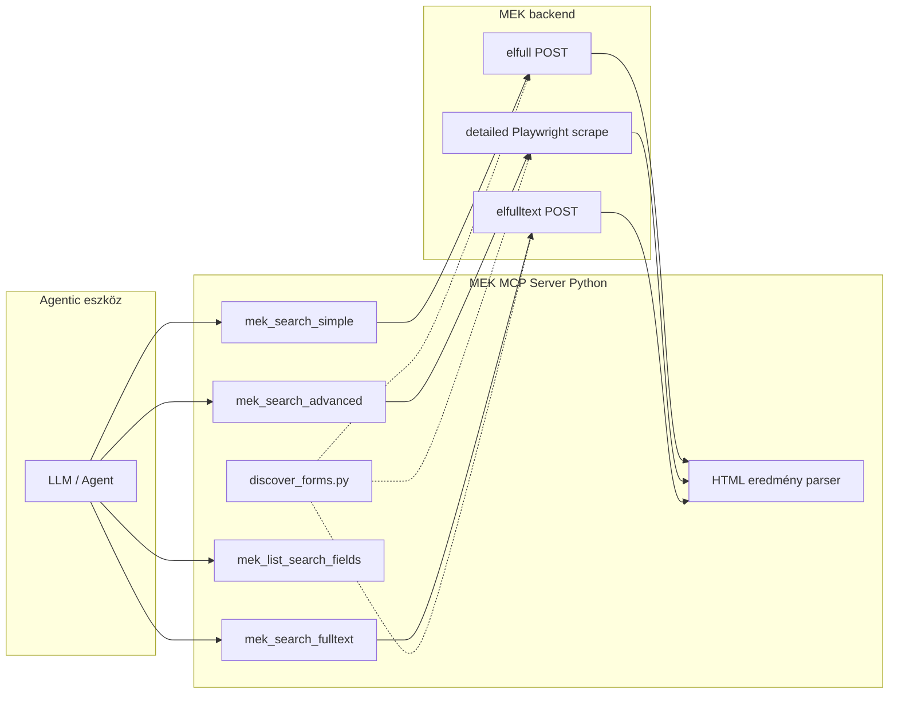

# MEK MCP szerver — architektúra

## Kontextus és kulcsfelismerés

A MEK **nem rendelkezik publikus REST/JSON API-val**. A keresés három különálló webes űrlapon fut, mögötte Elasticsearch-sel (metaadat + teljesszöveg) és egy régebbi katalógus-backenddel (összetett keresés).

A **Linked Open Data / SPARQL** végpont (`https://v.mek.oszk.hu/sparql`) csak bibliográfiai metaadatokat ad vissza, **nem indexeli a teljes szöveget**, és az OSZK szerint **nem frissül automatikusan** (utolsó dokumentált frissítés: 2019). Ezért a kereső MCP toolok **web scraping / form submission** alapúak; a SPARQL később opcionálisan **egyedi dokumentum metaadat-bővítésre** (`mek_get_document`) használható.



---

## Keresővégpontok és megvalósítás

### 1. Egyszerű keresés

| Tulajdonság | Érték |
|---|---|
| Oldal | `https://www.mek.oszk.hu/hu/search/elfull/` |
| Kliens | `mek_mcp/clients/simple_search.py` — `httpx` POST |
| Mezők | `dc_title`, `dc_subject`, `dc_creator`, `id`, `size`, `sort`, `from` |
| Logika | Mezők között AND; wildcard `*`; ékezet/stemming automatikus |
| Eredmény | HTML, `https://mek.oszk.hu/NNNNN/NNNNN` linkek |

**Lapozás és limit (MCP → LLM):**

| Paraméter | Default | Határ |
|---|---|---|
| `page_size` | 10 | 1–100 |
| `page` | 1 | 1-től, `from` offset a MEK felé |

A `SearchResult.total_hits` a teljes találatszám; a `documents` lista legfeljebb `page_size` elem. További találatok: ugyanaz a keresés, magasabb `page` értékkel.

### 2. Összetett keresés

| Tulajdonság | Érték |
|---|---|
| Oldal | `https://www.mek.oszk.hu/hu/search/detailed/` |
| Kliens | `advanced_search.py` + `detailed_scraper.py` (Playwright) |
| Megvalósítás | A böngésző kitölti a `katal` űrlapot, a `muvindexek()` JS elküldi a keresést, az eredmények az `Fresponse` iframe-ben jelennek meg |
| Mezők | 5 sor: `s1`–`s5` + `m1`–`m5`; operátorok: `muv1`–`muv4` (`and`/`or`/`not`); rendezés: `szerint`; `ekezet` (ékezet nélkül); `subid` (feldolgozás alatti dokumentumok) |
| Mezőválasztó | 24 opció soronként — aliasok: `FIELD_ALIASES` (`advanced_search.py`), listázás: `mek_list_search_fields` |
| Eredmény | iframe HTML: `.hit` elemek, `Találatok száma: N` |

**Miért scraping?** A detailed oldal nem ad vissza találatlistát közvetlen HTTP POST-tal — csak a JavaScript által indított iframe-kérés működik.

**Limit (MCP → LLM):**

| Paraméter | Default | Megjegyzés |
|---|---|---|
| `max_results` | 50 | Nincs felső kód-limit; a MEK egy listában adja vissza az összes találatot |
| Lapozás | — | Nincs — a scrape és parse a teljes HTML-t feldolgozza, majd `documents[:max_results]` |

A lassúság fő oka a Playwright scrape (~több tíz másodperc), nem a `max_results` értéke.

**MCP tool paraméterek (5 sor):** `field`/`query` … `field5`/`query5`, `operator` … `operator4`, `sort_by`, `accent_insensitive`, `include_processing`, `max_results`.

Programozói API: `criteria` lista + `operators` lista is használható (`search_advanced()`).

### 3. Szabad szavas / teljesszövegű keresés

| Tulajdonság | Érték |
|---|---|
| Oldal | `https://www.mek.oszk.hu/hu/search/elfulltext/` |
| Kliens | `mek_mcp/clients/fulltext_search.py` — `httpx` POST |
| Mezők | `body`, `broadtopic` (5 témakör + üres = teljes), `size`, `sort`, `from` |
| Témakör aliasok | `BROADTOPIC_ALIASES` — pl. `science`, `humanities` |

Lapozás és limit: ugyanaz, mint az egyszerű keresésnél (`page_size` 1–100, default 10).

---

## Eredmény modell

```python
class SearchResult:
    total_hits: int | None   # teljes találatszám a MEK-től
    page: int                # egyszerű/fulltext: aktuális oldal; advanced: mindig 1
    page_size: int           # egyszerű/fulltext: kért oldalméret; advanced: max_results
    documents: list[MekDocument]  # LLM-nek visszaadott szelet
    search_url: str
```

Az LLM **nem** kapja meg automatikusan az összes találatot — csak a `documents` szeletet és a `total_hits` számot. Egyszerű/fulltext esetén lapozással kérhető a maradék; összetett keresésnél csak `max_results` növelése segít.

---

## MCP tool felület

| Tool | Forrás | Agent használat |
|---|---|---|
| `mek_search_simple` | elfull POST | Gyors metaadat-keresés (szerző, cím, téma, ID) |
| `mek_search_advanced` | detailed Playwright | Mező-specifikus szűrés, max. 5 sor, AND/OR/NOT |
| `mek_search_fulltext` | elfulltext POST | Szövegtörzsben keresés |
| `mek_list_search_fields` | — | Advanced mező-aliasok és fulltext témakörök listája |

**Tervezett, még nincs implementálva:** `mek_get_document` (SPARQL/RDF metaadat-bővítés).

---

## Projektstruktúra

```
c:\Coding\MCP\
├── pyproject.toml
├── Dockerfile
├── render.yaml
├── docs/
│   └── architecture.md
├── scripts/
│   └── discover_forms.py
├── mek_mcp/
│   ├── server.py
│   ├── urls.py
│   ├── models.py
│   ├── clients/
│   │   ├── base.py
│   │   ├── simple_search.py
│   │   ├── advanced_search.py
│   │   ├── detailed_scraper.py
│   │   └── fulltext_search.py
│   └── parsers/
│       └── results.py
├── discovery/
│   └── output/
│       └── forms_report.json
└── tests/
    ├── test_advanced_search.py
    ├── test_discover_forms.py
    └── fixtures/
```

---

## Discovery script

**Cél:** Űrlap action/method/field listák kinyerése és próbakérésekkel validálás.

```bash
python scripts/discover_forms.py --probe
```

Kimenet: `discovery/output/forms_report.json`

---

## Transport és üzemeltetés

| Környezet | `MCP_TRANSPORT` | Megjegyzés |
|---|---|---|
| Lokális (Cursor) | `stdio` | `.cursor/mcp.json` |
| Render (production) | `streamable-http` | `/mcp` végpont |
| Legacy | `sse` | `/sse` + `/messages/` |

| Env változó | Jelentés |
|---|---|
| `HOST`, `PORT` | HTTP bind (Render injektálja a `PORT`-ot) |
| `MEK_PLAYWRIGHT_HEADLESS` | Headless Chromium (default: `true`) |
| `MEK_SCRAPE_TIMEOUT_MS` | Advanced scrape timeout (default: 60000; Render: 90000) |
| `MEK_REQUEST_DELAY_MS` | Késleltetés egyszerű/fulltext kérések között |
| `MEK_USER_AGENT` | User-Agent string |

**Render deploy:** `Dockerfile` (Playwright base image) + `render.yaml` Blueprint; health check: `GET /health`.

---

## Függőségek

- `mcp`, `uvicorn` — MCP szerver
- `httpx` — HTTP kliens
- `beautifulsoup4`, `lxml` — HTML parsing
- `playwright` — összetett keresés scraping
- `pydantic` — eredmény modellek

---

## Tesztelés

- Unit tesztek HTML parser fixtúrákkal (`tests/fixtures/`)
- Advanced search paraméter-építés és alias lefedettség tesztek
- Integrációs teszt `@pytest.mark.network` jelöléssel (élő MEK scrape)

```bash
pytest -m "not network"
pytest -m network   # élő hálózati tesztek
```

---

## Kockázatok és mitigáció

| Kockázat | Mitigáció |
|---|---|
| MEK HTML struktúra változik | Parser szelektorok egy helyen; discovery script periodikus újrafuttatása |
| Nincs hivatalos API-szerződés | Rate limit, request delay, egyértelmű hibaüzenetek |
| SPARQL adat elavult | Kereséshez nem használjuk; csak jövőbeli `mek_get_document` |
| Összetett keresés lassú | Playwright timeout konfigurálható; Render Starter plan ajánlott |
| Nagy találatszám (advanced) | `max_results` kontroll; MEK egy HTML-ben ad mindent |
| Karakterkódolás | Encoding detektálás a `base.py` client rétegben |

---

## Implementációs állapot

| Komponens | Állapot |
|---|---|
| Discovery script + `forms_report.json` | Kész |
| Egyszerű keresés (lapozás) | Kész |
| Szabad szavas keresés (lapozás) | Kész |
| Összetett keresés (5 sor, 24 mező, subid, ekezet) | Kész |
| MCP szerver (stdio + streamable-http + sse) | Kész |
| Docker + Render deploy | Kész |
| `mek_get_document` (SPARQL/RDF) | Tervezett |
