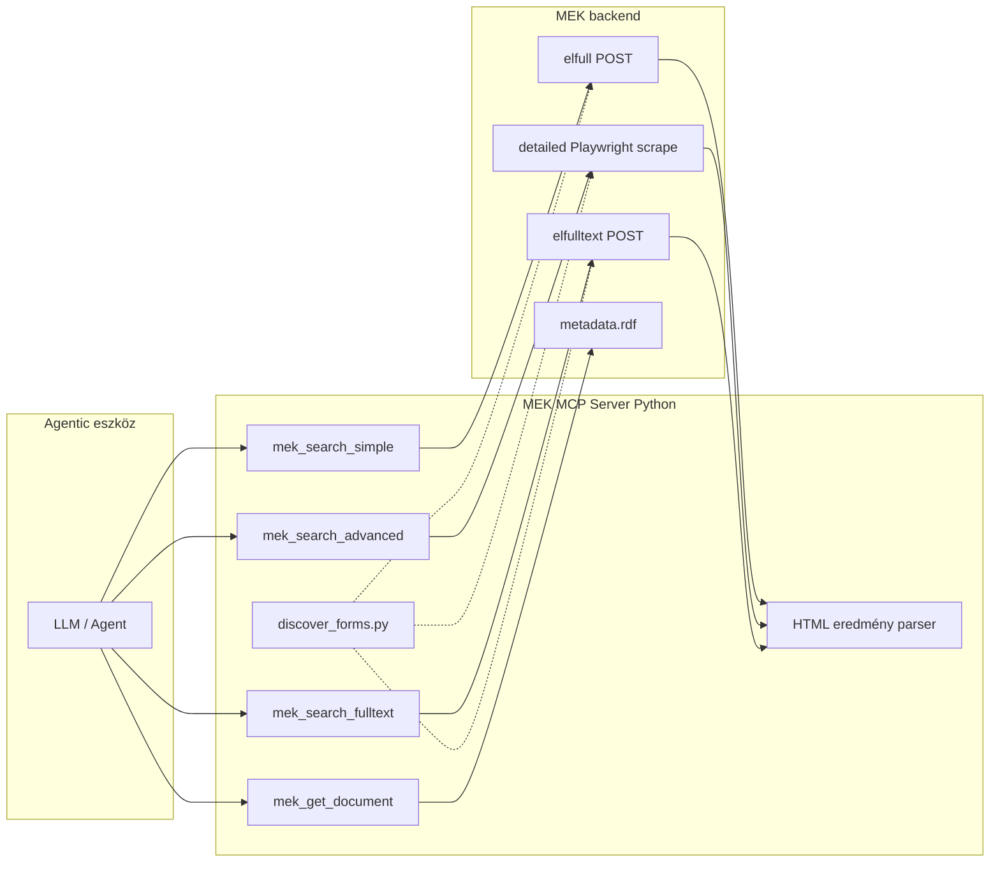

# MEK MCP szerver — architektúra és discovery script terv

## Kontextus és kulcsfelismerés

A MEK **nem rendelkezik publikus REST/JSON API-val**. A keresés három különálló webes űrlapon fut, mögötte Elasticsearch-sel (metaadat + teljesszöveg) és egy régebbi katalógus-backenddel (összetett keresés).

A **Linked Open Data / SPARQL** végpont (`https://v.mek.oszk.hu/sparql`) csak bibliográfiai metaadatokat ad vissza, **nem indexeli a teljes szöveget**, és az OSZK szerint **nem frissül automatikusan** (utolsó dokumentált frissítés: 2019). Ezért a kereső MCP toolok **web scraping / form submission** alapúak lesznek, a SPARQL opcionálisan csak **egyedi dokumentum metaadat-bővítésre** (`mek_get_document`).



---

## Feltárt keresővégpontok (előzetes discovery)

A readonly tesztelés alapján az alábbi paraméterek már ismertek; a discovery script ezeket validálja és kiegészíti válaszstruktúrával.

### 1. Egyszerű keresés

| Tulajdonság | Érték |
|---|---|
| Oldal | `https://www.mek.oszk.hu/hu/search/elfull/` |
| Method | `POST` (action=`#sealist`, ugyanarra az URL-re) |
| Mezők | `dc_title`, `dc_subject`, `dc_creator`, `id`, `size` (10/50/100), `sort`, `from` (lapozás) |
| Logika | Mezők között AND; ékezet/stemming automatikus |
| Eredmény | HTML, `https://mek.oszk.hu/NNNNN/NNNNN` linkek, `pageNextPrev(from, size)` lapozás |

### 2. Összetett keresés

| Tulajdonság | Érték |
|---|---|
| Oldal | `https://www.mek.oszk.hu/hu/search/detailed/` |
| Megvalósítás | **Playwright web scraping** — a böngésző kitölti az űrlapot, a `muvindexek()` JS elküldi a keresést, az eredmények az `Fresponse` iframe-ben jelennek meg |
| Mezők | 5 sor: `s1`–`s5` (mezőválasztó), `m1`–`m5` (érték), `muv1`–`muv4` (and/or/not), `szerint` (cimsz/szerzosz/idorend/idsz), `ekezet` |
| `s1` opciók | pl. `dc_title main`, `dc_creator_o FamilyGivenName`, `dc_subject keyword`, `dc_format format_name`, stb. (24 mező) |
| Eredmény | iframe HTML: `.hit` elemek, `Találatok száma: N`, MEK URL + cím + szerző |

**Miért scraping?** A detailed oldal nem ad vissza találatlistát közvetlen HTTP POST-tal az oldal URL-jére — csak a JavaScript által indított iframe-kérés működik. A `detailed_scraper.py` ezt automatizálja headless Chromium-mal.

### 3. Szabad szavas / teljesszövegű keresés

**Felület** — `https://www.mek.oszk.hu/hu/search/elfulltext/`

- `POST` ugyanarra az URL-re
- Mezők: `body`, `broadtopic` (5 témakör + üres = teljes), `size`, `sort`, `from`

---

## 1. fázis: `discover_forms.py` — paraméter-feltáró script

**Cél:** Automatikusan kinyerni minden releváns űrlap action/method/field listáját, majd próbakéréssel dokumentálni a válasz HTML struktúráját.

### Projektstruktúra

```
c:\Coding\MCP\
├── pyproject.toml
├── docs/
│   └── architecture.md
├── scripts/
│   └── discover_forms.py
├── mek_mcp/
│   ├── __init__.py
│   ├── clients/
│   ├── parsers/
│   └── models.py
├── discovery/
│   └── output/
└── tests/
    └── test_discover_forms.py
```

### Függőségek

- `httpx` — HTTP kliens (timeout, redirect követés)
- `beautifulsoup4` + `lxml` — űrlap parsing
- `pydantic` — strukturált kimenet séma
- `rich` — konzolos összefoglaló

### Script működése

1. **Űrlap-feltárás** — Minden céloldal letöltése, `<form>` elemek kinyerése
2. **Probe kérések** — Minimális tesztlekérdezések (pl. `dc_creator=Ady`, `body=magyar`)
3. **Kimenet** — `discovery/output/forms_report.json`

### CLI

```bash
python scripts/discover_forms.py --probe
```

---

## 2. fázis: MCP szerver (a discovery után)

### MCP tool felület (4 tool)

| Tool | Forrás | Agent használat |
|---|---|---|
| `mek_search_simple` | elfull POST | „Ady Endre versei”, gyors metaadat-keresés |
| `mek_search_advanced` | kataluj.php3 POST | Nyelv/formátum/CC licenc szerinti szűrés, AND/OR/NOT |
| `mek_search_fulltext` | elfulltext + legacy GET | Szövegtörzsben keresés; `mode: "simple" \| "advanced"` paraméter |
| `mek_get_document` | RDF content negotiation | Egy MEK ID részletes metaadatai |

### Rétegek

```
mek_mcp/server.py
mek_mcp/clients/
  ├── base.py
  ├── simple_search.py
  ├── advanced_search.py
  └── fulltext_search.py
mek_mcp/parsers/results.py
mek_mcp/models.py
```

---

## 3. fázis: Tesztelés és üzemeltetés

- Unit tesztek HTML parser fixtúrákkal
- Integrációs teszt `@pytest.mark.network` jelöléssel
- Konfiguráció: `.env` — `MEK_BASE_URL`, `MEK_REQUEST_DELAY_MS`, `MEK_USER_AGENT`

---

## Kockázatok és mitigáció

| Kockázat | Mitigáció |
|---|---|
| MEK HTML struktúra változik | Parser szelektorok egy helyen; discovery script periodikus újrafuttatása |
| Nincs hivatalos API-szerződés | Rate limit, cache (TTL), egyértelmű hibaüzenetek |
| SPARQL adat elavult | Kereséshez nem használjuk; csak `mek_get_document` kiegészítés |
| Összetett keresés iframe-es UX | Közvetlen POST `kataluj.php3`-ra |
| Karakterkódolás | Encoding detektálás mezőnként a client rétegben |

---

## Ajánlott implementációs sorrend

1. Projekt váz (`pyproject.toml`, mappák)
2. `scripts/discover_forms.py` — futtatás, `forms_report.json` ellenőrzése
3. `mek_mcp/parsers/results.py` — a report alapján
4. Search client modulok (simple → advanced → fulltext)
5. MCP server + Cursor konfiguráció
6. Tesztek fixtúrákkal
